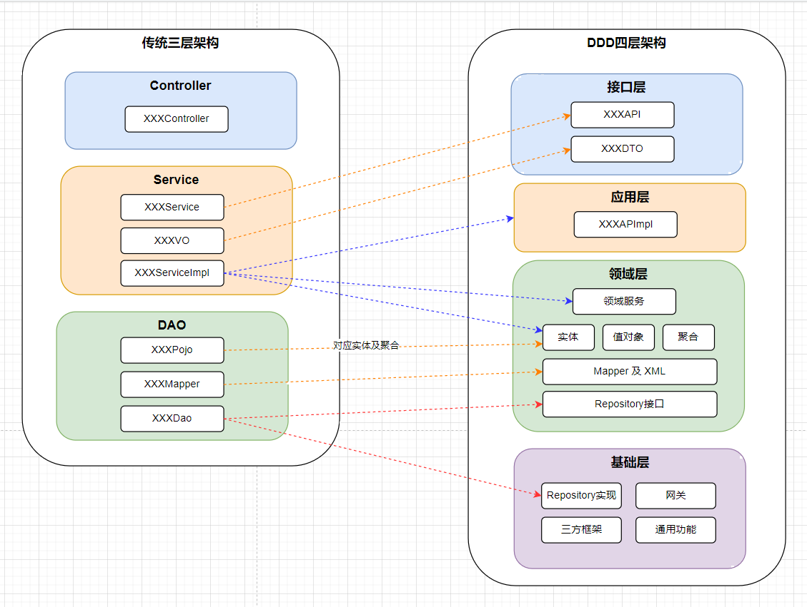

### DDD Demo

#### 1. 各目录接口
##### 1.1 application 应用层
负责服务的组合、编排及转发，负责处理业务用例的执行及结果的拼装。
appservice封装的功能类似三层架构中的service层，但并没不会负责具体业务，
仅仅对业务做封装，具体业务交由domain来完成。task主要用于实现定时任务，内部还可以分taskservice及tasklist.
tasklist封装了具体执行了任务，而tasklist的实现由于taskservice来完成， 同样taskservice也仅做功能的封装及聚合，
其内部实现还是通过domain来完成。event是领域驱动中的事件模型。
##### 1.2 interfaces 接口层
负责用户界面API，其中的controller对应原来三层架构中的controller层，dto 对应原来的view object
##### 1.3 infrastructure 基础层
##### 1.4 domain 领域层 亦核心层
领域层是领域驱动设计中的核心层，所有的业务都在此实现，其中包含三大模型：实体(entity)，值对象(vo)及聚合(aggregates).
其中聚合 aggregates 可分为多种聚合，每种聚合下面还可以有自身的实际entity及值对象 vo. aggregrate中的infrastructure
不同于最外层的infrastructure，最外层的infrastructure是用于封装公共配置，如utils类，而聚合中的infrastructure是封装
持久化对象使用。
